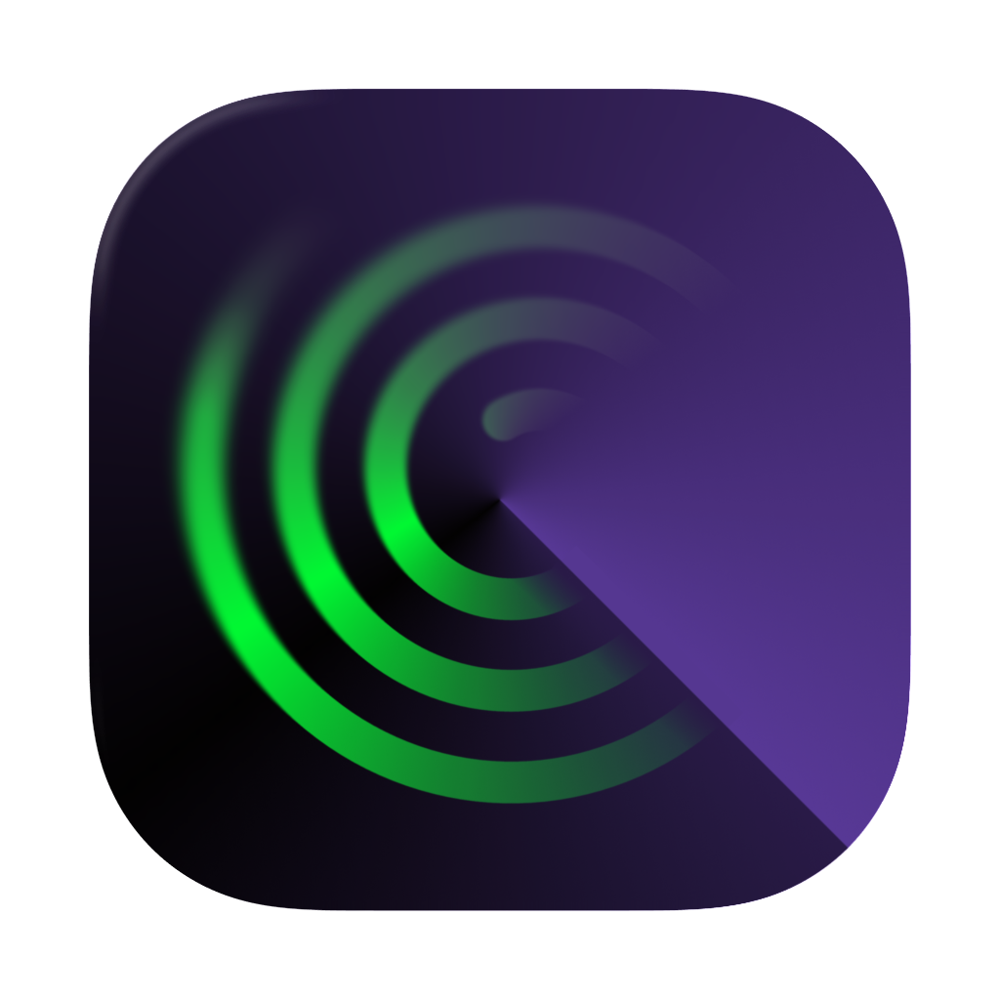

<div align=center>


# Release Maestro

</div>

A desktop app for tracking and discovering music releases from Bandcamp. Import release notifications from your inbox, browse a rich feed with cover art and metadata, and preview tracks — all without leaving the app.

## Features

- **Release feed** — Scrollable feed of music releases with cover art, tracklists, and artist info
- **Notification import** — Import Bandcamp notification emails via Apple Mail on macOS
- **Hydration** — Scrapes Bandcamp pages to enrich feed items with full metadata
- **Audio player** — Preview tracks directly in the feed
- **Keyboard navigation** — Navigate the feed with `J`/`K` or arrow keys
- **Local database** — All data stored locally in SQLite via Drizzle ORM

## Tech Stack

| Layer      | Technology                           |
| ---------- | ------------------------------------ |
| Frontend   | Angular, Tailwind CSS, ng-primitives |
| Backend    | Electron, Node.js                    |
| Database   | SQLite (better-sqlite3), Drizzle ORM |
| Validation | Zod                                  |
| Scraping   | Cheerio, bandcamp-fetch              |
| Build      | Nx (monorepo), electron-builder      |
| Testing    | Jest (unit), Playwright (E2E)        |

## Prerequisites

- Node.js >= 22.12.0
- npm
- macOS (required for Apple Mail email import; the app itself builds on all platforms)

## Getting Started

```bash
npm i
make dev

# Verifications
make format
make lint
make test
make build
make e2e
```

This starts the Angular dev server and the Electron main process with hot reload.

## Commands

Run `make help` for a list of commands to run.

## Project Structure

```
apps/
  maestro-electron/    Electron main process (backend services, IPC API, database)
  maestro-renderer/    Angular frontend (feed UI, audio player, settings)
  maestro-renderer-e2e/ E2E tests against the angular frontend
libs/
  maestro-core/        Shared library (Zod schemas, types, utilities)
apple-scripts/         AppleScript for exporting emails from Apple Mail
drizzle/               Database migrations
```

## Building for Distribution

```bash
make package
```

Produces platform-specific distributables in `dist/executables/`:

| Platform | Format               |
| -------- | -------------------- |
| macOS    | DMG (universal)      |
| Windows  | NSIS installer (x64) |
| Linux    | AppImage             |

## Database

Release Maestro uses SQLite with Drizzle ORM. Migrations live in `drizzle/` and are applied automatically on startup.

To generate a new migration after changing the schema:

```bash
make db-generate
```

## License

Copyright (c) 2026 Floyd Haremsa. All rights reserved for the original,
project-specific code in this repository. A small set of scaffold-derived files
is excluded pending rewrite and/or third-party notice cleanup. See
[LICENSE.md](LICENSE.md).
