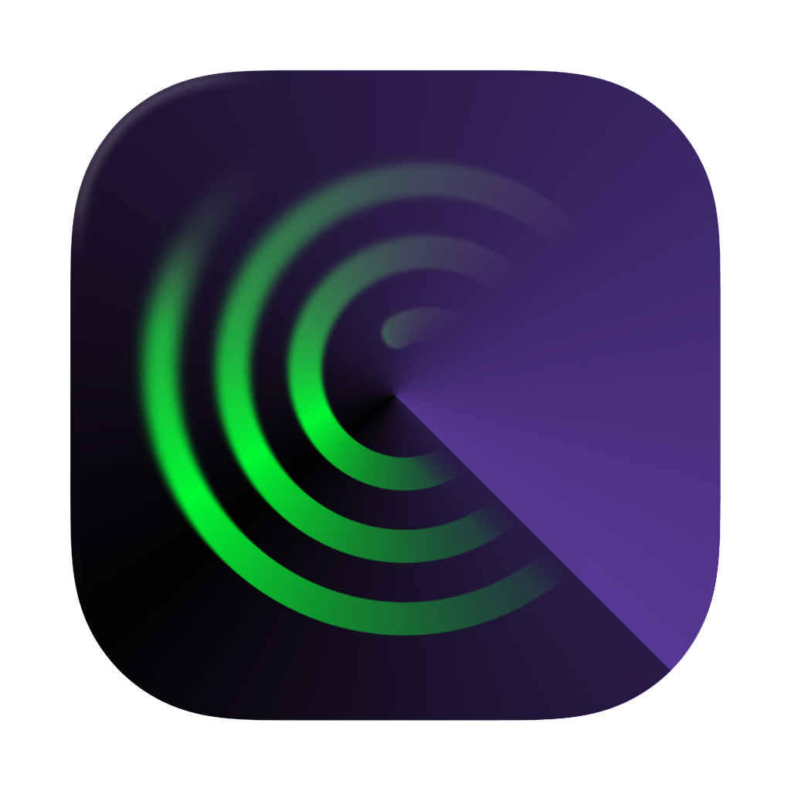

<div align=center>


# Release Maestro

</div>

A desktop app for your music. Scan your local collection into a searchable library, and track new releases from Bandcamp by importing notifications from your inbox — browse both with cover art and full metadata, without leaving the app.

## Tech Stack

| Layer      | Technology                           |
| ---------- | ------------------------------------ |
| Frontend   | Angular, Tailwind CSS, ng-primitives |
| Backend    | Electron, Node.js                    |
| Audio tags | Rust (metadata-engine sidecar)       |
| Database   | SQLite (better-sqlite3), Drizzle ORM |
| Validation | Zod                                  |
| Scraping   | Cheerio, bandcamp-fetch              |
| Build      | Nx (monorepo), electron-builder      |
| Testing    | Jest (unit), Playwright (E2E)        |

## Prerequisites

- Node.js >= 22.22.3 (see `.node-version`)
- npm
- A Rust toolchain — `apps/metadata-engine` is a Cargo crate built into a sidecar binary
- macOS (required for Apple Mail email import; the app itself builds on all platforms)

## Getting Started

```bash
npm i
make dev
```

This starts the Angular dev server and the Electron main process with hot reload.

## Commands

`make` is the repo-wide interface — run `make help` for the full list. It is what CI runs.

```bash
make sure          # format, lint, build, unit test, renderer E2E
make affected      # build, lint, unit/E2E tests for affected projects; no formatting
make format-check  # non-mutating formatting check
make e2e           # opt-in full Electron E2E; repeatedly opens the desktop app
make e2e-production # package and test the production desktop app for this OS
make e2e-renderer  # renderer-only E2E (type-checks itself first)
```

`make sure` mutates formatting. Full Electron E2E is deliberately not part of it because repeatedly
opening and closing Electron interrupts the developer's desktop session; run `make e2e`
intentionally when a changed user journey needs full-app coverage.

For focused work on a single project, go straight to nx rather than through make — it schedules and
caches per project better:

```bash
npx nx test maestro-renderer
npx nx lint maestro-electron
npx nx build maestro-core
```

There is no repo-wide typecheck target; `build` is the type gate for app code. See
[docs/testing.md](docs/testing.md) for testing strategy, E2E conventions, and fixture guidance.

## Documentation

- [CONTEXT-MAP.md](CONTEXT-MAP.md) — the two product contexts (music library, release feed), their
  glossaries in [docs/contexts/](docs/contexts/), and which projects each context spans
- [docs/adr/](docs/adr/) — architectural decisions and the reasoning behind non-obvious ones
- [docs/testing.md](docs/testing.md) — test layers, E2E conventions, fixtures

## Projects

Five Nx projects, whose names are not self-explanatory:

- **`maestro-electron`** — Electron main process: backend services, the IPC API, the database.
- **`maestro-renderer`** — Angular frontend: feed UI, library import, audio player, settings.
- **`maestro-core`** — shared Zod schemas and types. The contract for everything crossing the
  main/renderer and metadata-engine boundaries.
- **`metadata-engine`** — Rust sidecar that reads and writes audio file tags.
- **`maestro-e2e`** — both E2E suites, renderer-only and full Electron.

`apple-scripts/` holds the AppleScript that exports mail out of Apple Mail; `drizzle/` holds
migrations. A project's `project.json` declares its explicit configuration, but Nx can infer
additional targets. Use `npx nx show project <project> --web false` for the effective project and
target inventory.

Note that the project layout is not the product layout: both product contexts (music library, release
feed) cut across `maestro-electron`, `maestro-renderer`, and `maestro-core`. See
[CONTEXT-MAP.md](CONTEXT-MAP.md).

## Building for Distribution

```bash
make package
```

Produces platform-specific distributables in `dist/executables/`:

| Platform | Format               |
| -------- | -------------------- |
| macOS    | DMG (universal)      |
| Windows  | NSIS installer (x64) |
| Linux    | AppImage             |

## Database

Release Maestro uses SQLite with Drizzle ORM. Migrations live in `drizzle/` and are applied automatically on startup.

To generate a new migration after changing the schema — the name is required:

```bash
make db-generate NAME=add_users_table
```

Not all state lives in SQLite. User settings are a `conf` file in the app's **config** dir; library
scan state (`library-state.json`) is a separate `conf` file in the **data** dir, because it is derived
state that belongs with the database rather than user configuration
([ADR 0001](docs/adr/0001-main-process-owns-scan-lifecycle.md)). To reset just the library — song
tables plus that sidecar, leaving migrations and the release feed intact:

```bash
make db-truncate-library
```

## License

Copyright (c) 2026 Floyd Haremsa. All rights reserved for the original,
project-specific code in this repository. A small set of scaffold-derived files
is excluded pending rewrite and/or third-party notice cleanup. See
[LICENSE.md](LICENSE.md).
